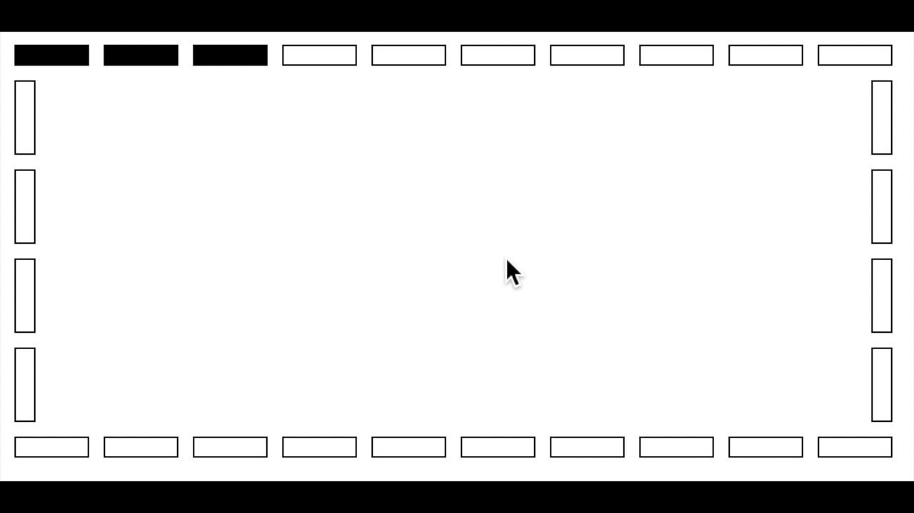

# LED Lights

In JavaScript, you can tell the browser to execute code every _n_ milliseconds, with a function call `setInterval`.

For example, if you wanted to log the time every second, you would write:

```javascript
setInterval(
  function () {console.log(new Date())}, 
  1000
);
```

`setInterval` takes a function, and the number of milliseconds to wait before calling that function.

Your mission, should you choose to accept it, is to take the existing code, and change the background colors of the
 divs such that the result looks like this:



Write your code in the `js/animation.js` file.  You are handed an array of divs, and you need to write some code
that uses `setInterval` to set the background colors correctly.

# Extra

Add a button to the page to toggle the marquee on and off.  To accomplish this, look into `clearInterval`.

# Setup

* Fork
* Clone
* Turn on TravisCI for the fork by
  visiting https://travis-ci.org/profile/<github user name>, clicking the "Sync now" button
  and scrolling down to find the repository to build.
* Create a new branch for your work using `git checkout -b v1`
* Implement specs and code
* Push using `git push -u origin v1`

## Further Practice

This warmup can be completed multiple times to increase your comfort level with the material.
To work on this from scratch, you can:

1. Add an upstream remote that points to the original repo `git remote add upstream git@github.com:gSchool/THIS-REPO.git`
1. Fetch the latest from the upstream remote using `git fetch upstream`
1. Create a new branch from the master branch of the upstream remote `git checkout -b v2 upstream/master`
1. Implement specs and code
1. Push using `git push -u origin v2`

Each time you do the exercise, create a new branch. For example the 3rd time you do the exercise the branch
name will be v3 instead of v2.